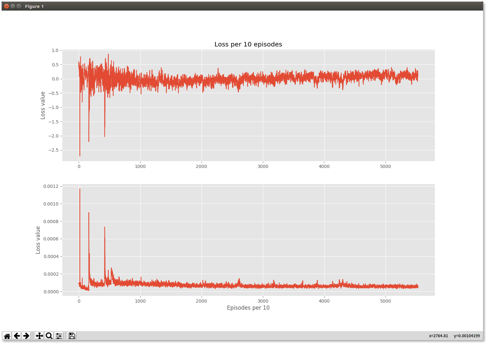

# CommNet
an implementation of CommNet

**What's CommNet**

Many tasks in AI require the collaboration of multiple agents. Typically, the communication protocol between agents is manually specified and not altered during training. *CommNet* is a simple neural model, that uses continuous communication for fully cooperative tasks. The model consists of multiple agents and the communication between them is learned alongside their policy. 

*Demostrating*

demonstrating the ability of the agents to learn to communicate amongst themselves, yielding improved performance over non-communicative agents and baselines. In some cases, it is possible to interpret the language devised by the agents, revealing simple but effective strategies for solving the task at hand.

*Tasks*

1. Leaver Pulling game
2. Traffic Junction

**Plot of Loss (leaver pulling game)**

**Plot of reward and baseline**

